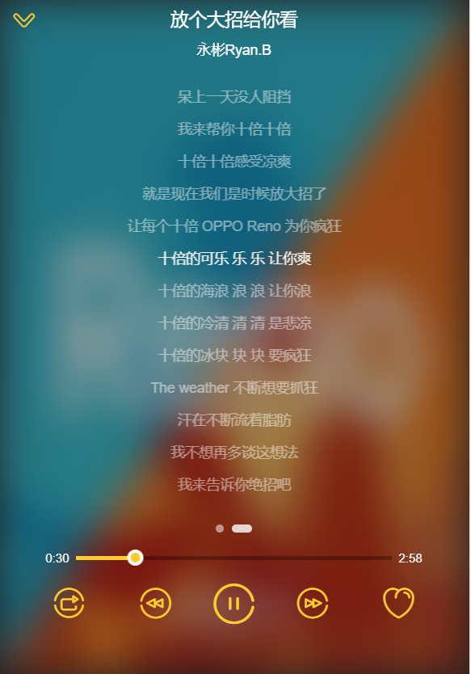

# vue-music

> 音乐播放应用

## Build Setup

``` bash
# install dependencies
npm install

# serve with hot reload at localhost:8080
npm run dev

# build for production with minification
npm run build

# build for production and view the bundle analyzer report
npm run build --report
```

For a detailed explanation on how things work, check out the [guide](http://vuejs-templates.github.io/webpack/) and [docs for vue-loader](http://vuejs.github.io/vue-loader).
***
---
###### 运行效果图
<table>
    <tr>
        <td ><center>推荐页面</center></td>
        <td ><center>推荐页面</center></td>
        <td ><center>推荐页面</center></td>
        <td ><center>推荐页面</center></td>
    </tr>
    <tr>
        <td ><center>歌手页面</center></td>
        <td ><center>歌手页面</center></td>
        <td ><center>歌手页面</center></td>
        <td ><center>歌手页面</center></td>
    </tr>
    <tr>
        <td ><center>榜单页面</center></td>
        <td ><center>榜单页面</center></td>
        <td ><center>榜单页面</center></td>
        <td ><center>榜单页面</center></td>
    </tr>
</table>

---
### 开发中的一些问题
###### (注意：有些歌手的歌曲或某几首歌曲可能无法播放，因为无法获取vkey，如：周杰伦【其他的目前没有发现】)
* 1 使用vuex 进行 项目状态管理  （问题：在页面使用 computed进行 ...mapGetter 数据获取，在state 中数据发生改变时同步更新组件）
  但是在 singer-detail.vue 中发现 state.singer 中对象已经发生改变了。但是 使用...mapGetter(['singer']) 获取的this.singer
  任然没有发生改变（任然是第一次赋值的对象）；后来使用直接获取的方式 `` this.singer = this.$store.state.singer` 可以获取到改变的值
   但是在 player.vue 中发现这种方式是否没有任何作用，于是再次寻找答案，终于在
>   CSDN https://blog.csdn.net/haoge744/article/details/88815196
 中找到了答案。直接将mutation 中 `state.prop = val 改为Vue.set(state,'prop',val) `问题得以解决

* 2 使用 state 中数据一直提示
``` javaScript
vue.esm.js?efeb:628 [Vue warn]: Error in render: "TypeError: Cannot read property 'undefined' of undefined"
found in
```
 原因 ： 异步显示的数据先显示vuex中的初始数据，再显示请求的数据，一开始在vuex中state中的初始数据为空，报错是因为在显示初始数据的时候报错
 在加载数据之前使用一下 v-if = "variable" 数据才解析

* 3  在.vue中直接使用 ` ...mapMutations ` 改变state
``` javaScript
    methods: {
      back() {
        this.setFullScreen(false)
      }
    },
    ...mapMutations({
      setFullScreen: 'SET_FULL_SCREEN'
    })
```
#### 发现一直提示
``` javaScript
[Vue warn]: Error in v-on handler: "TypeError: this.setFullScreen is not a function"

found in
```
######  what ? what what ? ?
* 我要画个圈圈诅咒你 ！

转了一圈后来才发现是 ` mapMutations`写错了位置

``` javaScript
    methods: {
      back() {
        this.setFullScreen(false)
      },
      ...mapMutations({
        setFullScreen: 'SET_FULL_SCREEN'
      })
    }
```

* 4 使用transition 制作播放器动画时，发现交互动画实现了，但是在过渡完成后 歌手列表页面无法点击了，百思不得其解，最后定位错误代码如下
``` javaScript
        let animation = {
          0: {
            transform: `translate3d(${x}px,${y}px,0) scale(${scale}))`
          },
          60: {
            transform: `translate3d(0,0,0) scale(1.1))`
          },
          100: {
            transform: `translate3d(0,0,0) scale(1))`
          }
        }
```
你有看出错误在哪里吗？ --多个了小括号，哎

* 5 在getter 中使用表达式获取 属性值老实报错，如下
``` javaScript
export const cSong = (state) => {
  return state.playList[state.currentIndex] || {}
}
```
错误提示
`Vue warn]: Error in getter for watcher "cSong": "TypeError: Cannot read property 'undefined' of undefined"

 found in

 ---> <Player> at src/components/player/player.vue
        <App> at src/App.vue
          <Root>`

哎至今不知为何？？？ 还是只能换成老实的写法
getter.js
`export const cSong = state => state.cSong`
state.js
`  cSong: {}`
mutations.js
`  [types.SET_C_SONG](state, song) {
     Vue.set(state, 'cSong', song)
   }`
mutation-type.js
`export const SET_C_SONG = 'SET_C_SONG'`
actions.js
`commit(types.SET_C_SONG, list[index])`

* 6 这个问题不解  。。 我在 app.vue中使用 watch 监听cSong ，最后我在 player.vue 中再次使用watch 监听
这个值，发现只有在app.vue中有响应，在player.vue中就没响应了？？？难道一个值只能监听一次？

* 7 切记 不可以对 state中类型是array 参数; 只能使用`state.sequenceList = list`进行mutation
岂不可使用 如 ：`Vue.set(state, 'sequenceList', list)` mutation
否则会让你错得怀疑人生
`
vue.esm.js?efeb:628 [Vue warn]: Error in callback for watcher "function () { return this._data.$$state }":
"Error: [vuex] do not mutate vuex store state outside mutation handlers."

(found in <Root>)

Error: [vuex] do not mutate vuex store state outside mutation handlers.
     at assert (vuex.esm.js?358c:90)
     at Vue.store._vm.$watch.deep (vuex.esm.js?358c:774)
     at Watcher.run (vue.esm.js?efeb:4571)
     at Watcher.update (vue.esm.js?efeb:4545)
     at Dep.notify (vue.esm.js?efeb:739)
     at Array.mutator (vue.esm.js?efeb:891)
     at eval (singer-detail.vue?1be9:59)`

这样就ok 了， 所以细心是关键哈


* 8 知道为啥
actions.js中不初始化一下mode 在player.vue中的`...mapGetters({'mode'})` mode 取出来始终为undefined
```
  commit(types.SET_PLAY_MODE, playMode.sequence)
```

* 9 发现一个css 冲突的问题【在榜单页面 -> 榜单详情页面】 其中 的排名icon一直固定在某一行，奇怪的是v-for打印的为什么只有一个地方显示了icon
最后经浏览器调试发现是同名的class 未限制作用域造成的
<table>
    <tr>
        <td ><center>ico 位置异常</center></td>
        <td ><center>song-list.vue添加 scoped</center></td>
        <td><center>rank.vue添加 scoped</center></td>
        <td ><center>运行正常了</center> </td>
    </tr>
</table>


|   language    |      familiarity    |      duration         |
|-------------- | :------------------:| :--------------------:|
|    C          |        general      |          1M           |
|    C++        |        general      |          3M           |
|    C#         |        general      |          7M           |
|    OC         |        general      |          2M           |
|   JAVA        |        general      |          3Y           |
|     R         |        know         |                       |
|    GO         |        know         |                       |
|  JAVASCRIPT   |        general      |          3Y           |

###### 该项目为自我学习案例，写得不好 大神勿喷，觉得有帮助的请捧捧场 star 一下作为鼓励，谢谢。
